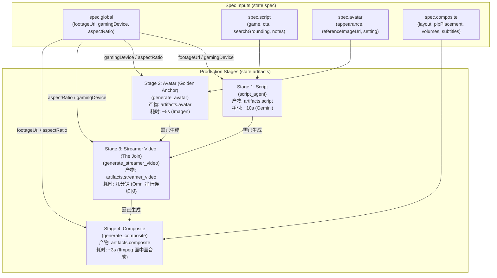

# Coding Agent Guide

## Prerequisites

Install the CLI (one-time):
```bash
uv tool install google-agents-cli
```

---

## Development Phases

### Phase 1: Understand Requirements
Before writing any code, understand the project's requirements, constraints, and success criteria.

### Phase 2: Build and Implement
Implement agent logic in `app/`. Use `agents-cli playground` for interactive testing. Iterate based on user feedback.

### Phase 3: The Evaluation Loop (Main Iteration Phase)
Start with 1-2 eval cases, run `agents-cli eval run`, iterate by making changes and rerunning it until satisfied. Expect 5-10+ iterations. Once you have a baseline, reach for `agents-cli eval compare` (regression diffs), `agents-cli eval analyze` (cluster failure modes), and `agents-cli eval optimize` (auto-tune prompts). See the **Evaluation Guide** for metrics, dataset schema, LLM-as-judge config, and common gotchas.

### Phase 4: Pre-Deployment Tests
Run `uv run pytest tests/unit tests/integration`. Fix issues until all tests pass.

### Phase 5: Deploy to Dev
**Requires explicit human approval.** Run `agents-cli deploy` only after user confirms. See the **Deployment Guide** for details.

### Phase 6: Production Deployment
Ask the user: Option A (simple single-project) or Option B (full CI/CD pipeline with `agents-cli infra cicd`).

## Development Commands

| Command | Purpose |
|---------|---------|
| `agents-cli playground` | Interactive local testing |
| `uv run pytest tests/unit tests/integration` | Run unit and integration tests |
| `agents-cli eval dataset synthesize` | Synthesize multi-turn eval scenarios for your agent |
| `agents-cli eval run` | Run the agent over the eval dataset and grade the traces |
| `agents-cli eval generate` / `agents-cli eval grade` | Decoupled form: produce traces, then grade them |
| `agents-cli eval compare` | Compare two grade-results files (regression check) |
| `agents-cli eval analyze` | Cluster failure modes from grade results |
| `agents-cli eval metric list` | List built-in metrics available in the SDK |
| `agents-cli eval optimize` | Auto-tune agent prompts using eval data |
| `agents-cli lint` | Check code quality |
| `agents-cli infra single-project` | Set up project infrastructure (Terraform) |
| `agents-cli deploy` | Deploy to dev |
| `agents-cli scaffold enhance` | Add deployment target or CI/CD to project |
| `agents-cli scaffold upgrade` | Upgrade project to latest version |

---

## GamerHeads System Architecture: Spec, DAG, and Artifacts

### 1. State Model (Strictly 2 Top-Level Keys)

Session state (`tool_context.state`) contains strictly **two** root keys:
- **`state["spec"]`** (Input): The single source of truth for production specifications, partitioned into domain scopes:
  - `spec["global"]`: Global video parameters (`footageUrl`, `gamingDevice`, `aspectRatio`).
  - `spec["script"]`: Scriptwriting parameters (`game`, `gameUrl`, `searchGrounding`, `cta`, `additionalInstructions`).
  - `spec["avatar"]`: Streamer likeness parameters (`appearance`, `referenceImageUrl`, `setting`).
  - `spec["composite"]`: Video layout and audio parameters (`layout`, `pipPlacement`, `stackedPlacement`, `gameplayVolume`, `streamerVolume`, `subtitles`).
- **`state["artifacts"]`** (Output): The generated deliverables from specialist agents/tools:
  - `artifacts["script"]`: Timed commentary shot list (`segments`, `total_duration`, `device`, `groundingUrls`).
  - `artifacts["avatar"]`: Golden Anchor portrait image (`object`, `mimeType`, `aspectRatio`).
  - `artifacts["streamer_video"]`: Stitched reactions video of the streamer.
  - `artifacts["composite"]`: Final finished reaction video over the gameplay.

### 2. The Diamond Pipeline Flow

The production flow forms a **Diamond DAG** (not a linear sequence):



- **Independent Parallel Branches (Stages 1 & 2)**:
  - **Stage 1 (Script)**: Watches gameplay footage and generates a timed shot list. Independent of Avatar; uses gender-neutral pronouns (`they`/`them`) and describes only human micro-actions.
  - **Stage 2 (Avatar)**: Draws the streamer likeness portrait ("The Golden Anchor"). Independent of Script.
  - *Stages 1 and 2 can execute in either order.*
- **The Join Node (Stage 3 - Streamer Video)**:
  - The only node requiring both `artifacts["script"]` and `artifacts["avatar"]`.
  - Generates consecutive clips via Omni image-to-video, where segment $N$'s first frame is conditioned on segment $N-1$'s last frame (Segment 0 starts from the Golden Anchor avatar).
- **Lightweight Composite (Stage 4)**:
  - Uses ffmpeg to overlay the streamer video onto the gameplay footage.
  - Decoupled from Stage 3: changing composite layout (e.g. PIP placement) or audio volumes takes ~3 seconds of ffmpeg and does **not** re-render the expensive streamer video.

### 3. DAG Impact Analysis & Stage Contracts (Artifacts as Downstream Inputs)

In our AIGC video pipeline, **upstream artifacts act directly as downstream input parameters**:
- **Stage 1 (`script`)**: Consumes `spec.global.footageUrl`, `spec.script.*`, `spec.global.gamingDevice`. Produces `artifacts["script"]`.
- **Stage 2 (`avatar`)**: Consumes `spec.avatar.*`, `spec.global.gamingDevice`, `spec.global.aspectRatio`. Produces `artifacts["avatar"]`.
- **Stage 3 (`streamer_video`)**: Primary inputs ARE upstream deliverables: `artifacts["script"]` and `artifacts["avatar"]`! Produces `artifacts["streamer_video"]`.
- **Stage 4 (`composite`)**: Primary inputs ARE `artifacts["streamer_video"]`, `spec.global.footageUrl`, and `spec.composite.*`. Produces `artifacts["composite"]`.

We eliminate artificial "stale" or "approved" state machine flags in favor of a true **Centralized Pipeline Manager (`app/pipeline.py`)**:
- **`ARTIFACT_DEPENDENCIES`** (Artifact-to-Artifact Graph):
  - `script` $\rightarrow$ `["streamer_video"]`
  - `avatar` $\rightarrow$ `["streamer_video"]`
  - `streamer_video` $\rightarrow$ `["composite"]`
  - *Crucial Rule*: `streamer_video` renders the streamer speaking the commentary lines. Therefore, whenever `script` changes (or when any spec parameter that alters script dialogue changes), existing `streamer_video` and `composite` are transitively out of sync!
- **`PARAM_DEPENDENCIES`** (Param-to-Artifact Mapping with Cascading Reach):
  - `footageUrl` $\rightarrow$ `["script", "streamer_video", "composite"]`
  - `game`, `gameUrl`, `searchGrounding`, `cta`, `additionalInstructions` $\rightarrow$ `["script", "streamer_video"]`
  - `appearance`, `referenceImageUrl`, `setting` $\rightarrow$ `["avatar", "streamer_video"]`
  - `gamingDevice` $\rightarrow$ `["script", "avatar", "streamer_video"]`
  - `aspectRatio` $\rightarrow$ `["avatar", "streamer_video", "composite"]`
  - `layout`, `pipPlacement`, `volumes`, `subtitles` $\rightarrow$ `["composite"]`
- **Smart Downstream Impact Detection**:
  - Both `update_spec` and specialist agents (e.g. `script_agent` when editing/regenerating commentary) call `detect_impact(item, state)` from `app.pipeline`.
  - An alert is reported if an affected downstream deliverable **already exists in state**:
    `⚠️ Downstream Impact Detected (Existing Artifacts Out of Sync)`
  - The Director naturally asks the user if they wish to re-generate or re-align the affected downstream artifact (e.g., asking if they want a fresh streamer video matching the new commentary lines).

### 4. Real-Time Production Kanban & Dynamic Instruction Injection

To prevent the Director from "forgetting" pending remakes or remaining pipeline stages across multi-turn interactions:
- **`render_pipeline_kanban(state)`**: Evaluates each stage status (`READY`, `OUT_OF_SYNC`, `PENDING`, `BLOCKED`) based on `context.state` and timestamp comparison (`_updated_at`).
- **Dynamic Instruction Provider**: In `app/agent.py`, `root_agent` uses ADK's native `instruction=director_instruction(context: ReadonlyContext)`.
- On **every single turn**, the current Kanban dashboard and active director focus are injected into the model's system prompt, ensuring zero context decay and immediate visibility of all out-of-sync downstream assets.

### 5. Single Source of Truth & Explicit Set/Get

- **One Way In**: The Coordinator / Director calls `update_spec(key=val, ...)` with flat, natural arguments. The tool's internal `PARAM_SCOPE_MAP` programmatically routes them into `spec[scope][key]`.
- **Explicit Get**: Downstream specialist agents read exact keys directly from their domain scope (e.g. `spec.get("script", {}).get("game", "")`) with no defensive `or` fallback chains.
- **One Way Out**: Generators write their deliverables directly to `state["artifacts"][target]` via `record_artifact(state, target, data)`.

---

## Operational Guidelines for Coding Agents

- **Code preservation**: Only modify code directly targeted by the user's request. Preserve all surrounding code, config values (e.g., `model`), comments, and formatting.
- **NEVER change the model** unless explicitly asked.
- **Model 404 errors**: Fix `GOOGLE_CLOUD_LOCATION` (e.g., `global` instead of `us-east1`), not the model name.
- **ADK tool imports**: Import the tool instance, not the module: `from google.adk.tools.load_web_page import load_web_page`
- **Run Python with `uv`**: `uv run python script.py`. Run `agents-cli install` first.
- **Stop on repeated errors**: If the same error appears 3+ times, fix the root cause instead of retrying.
- **Terraform conflicts** (Error 409): Use `terraform import` instead of retrying creation.
