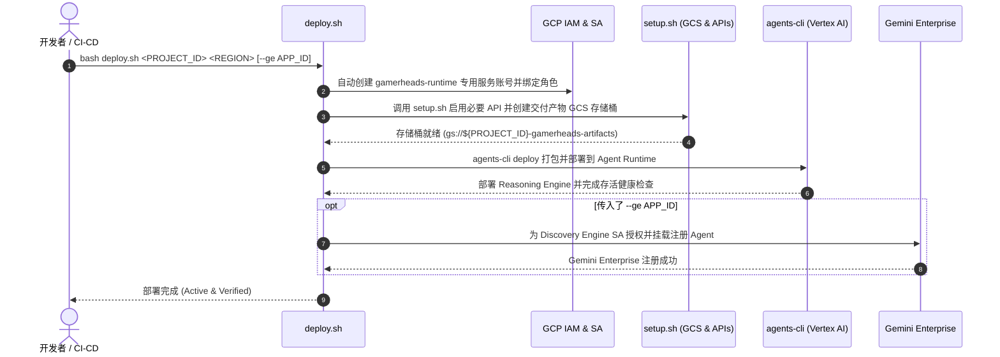
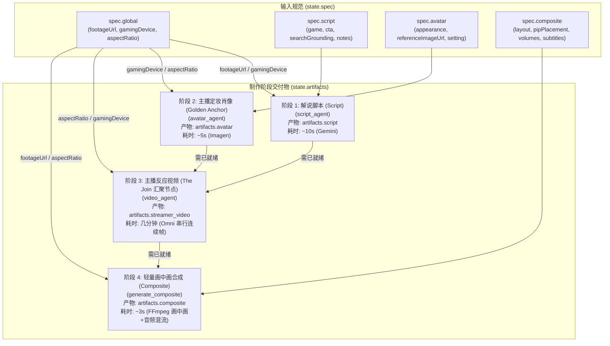

# GamerHeads 游戏反应视频导演 (GamerHeads Gameplay Reaction Director)

专为游戏创作者打造的 AIGC 创意导演 Agent。基于 **Google ADK (Agent Development Kit)** 与 **agents-cli** 构建，能够将玩家上传的实机游戏录屏全自动转化为包含**个性化虚拟主播出镜、解说配音、表情口型同步以及画中画（PIP）/ 分屏合成**的高品质游戏反应视频。

---

## 目录

- [🚀 一键部署指南 (deploy.sh)](#-一键部署指南-deploysh)
  - [快速一键部署](#快速一键部署)
  - [前置要求](#前置要求)
  - [脚本语法与参数说明](#脚本语法与参数说明)
  - [自动化执行流程](#自动化执行流程)
  - [常见部署示例](#常见部署示例)
  - [云端资源清理 (setup.sh)](#云端资源清理-setupsh)
- [🌟 核心特性](#-核心特性)
- [📐 系统架构与工作流 (Diamond DAG)](#-系统架构与工作流-diamond-dag)
- [💻 本地开发与快速上手](#-本地开发与快速上手)
- [📁 项目目录结构](#-项目目录结构)
- [📋 常用命令速查表](#-常用命令速查表)
- [📡 可观测性与 A2A 协议支持](#-可观测性与-a2a-协议支持)

---

## 🚀 一键部署指南 (`deploy.sh`)

项目提供了生产就绪的一键部署脚本 [`deploy.sh`](file:///Users/zgz/gamerheads-agent/deploy.sh)，旨在将 GamerHeads Agent 全自动部署至 **Google Cloud Vertex AI Agent Runtime (Reasoning Engine)**，并支持无缝注册挂载至 **Gemini Enterprise**。

### 快速一键部署

仅需一行命令即可完成从 IAM 授权、云资源准备、依赖打包、Vertex AI Reasoning Engine 部署到存活验证的全流程：

```bash
# 部署至 Vertex AI (默认 us-central1)
bash deploy.sh <YOUR_PROJECT_ID>

# 或部署并一键注册至 Gemini Enterprise
bash deploy.sh <YOUR_PROJECT_ID> us-central1 --ge <YOUR_GE_APP_ID>
```

---

### 前置要求

执行部署前，请确保本地已准备好以下工具与环境：

1. **Google Cloud SDK (`gcloud`)**：已安装并完成登录认证 - [安装指引](https://cloud.google.com/sdk/docs/install)
   ```bash
   gcloud auth login
   gcloud auth application-default login
   ```
2. **目标 GCP 项目权限**：执行者账号需具备项目 `Owner` 或 `Editor` + `Security Admin`（用于创建 Service Account 与绑定 IAM）。
3. **Python & uv**：Python `>= 3.11, < 3.14`，安装了 `uv` 包管理器 - [安装指引](https://docs.astral.sh/uv/getting-started/installation/)

---

### 脚本语法与参数说明

```bash
bash deploy.sh <PROJECT_ID> [REGION] [--ge APP_ID]
```

支持通过位置参数或明确 Flag 进行传参：

```bash
bash deploy.sh <PROJECT_ID> --region <REGION> --ge <APP_ID>
```

#### 参数详解

| 参数 / 选项 | 必填 | 默认值 | 说明 |
| :--- | :---: | :---: | :--- |
| `PROJECT_ID` | **是** | - | 目标 Google Cloud 项目 ID（首个位置参数）。 |
| `REGION` / `-r` / `--region` | 否 | `us-central1` | 部署地域（如 `us-central1`, `us-east4` 等）。 |
| `--ge APP_ID` / `--ge=APP_ID` | 否 | - | Gemini Enterprise 应用（Search/Assistant Engine）ID。指定后会自动完成权限配置并将 Agent 注册到该 Gemini Enterprise 助手。 |

---

### 自动化执行流程

[`deploy.sh`](file:///Users/zgz/gamerheads-agent/deploy.sh) 会全自动顺序执行以下四个关键步骤：



#### 1. 专用运行服务账号与 IAM 配置
- 自动创建最小权限运行服务账号：`gamerheads-runtime@${PROJECT_ID}.iam.gserviceaccount.com`。
- 授予 Vertex AI、服务消费、日志写入与链路追踪权限：
  - `roles/aiplatform.user`
  - `roles/serviceusage.serviceUsageConsumer`
  - `roles/logging.logWriter`
  - `roles/cloudtrace.agent`
- 赋予当前部署账号操作该 SA 的 `roles/iam.serviceAccountUser` 与 Token 生成权限。

#### 2. 云资源环境初始化 ([`setup.sh`](file:///Users/zgz/gamerheads-agent/setup.sh))
- 自动批量启用所有必需的 Google Cloud APIs（Vertex AI、Cloud Build、Cloud Storage、Discovery Engine、Cloud Trace、App Hub 等）。
- 自动创建专属交付产物 GCS 存储桶：`gs://${PROJECT_ID}-gamerheads-artifacts`（开启统一存储桶级别访问控制）。
- 为运行时服务账号授予存储桶级别的对象管理权限：`roles/storage.objectAdmin`。

#### 3. 依赖打包与 Vertex AI Reasoning Engine 部署
- 自动同步项目虚拟环境依赖与 `agents-cli`。
- 执行 `agents-cli deploy` 打包代码与依赖，将其部署为 Vertex AI Reasoning Engine。
- 自动注入运行时环境变量：
  - `ARTIFACT_BUCKET_NAME=${PROJECT_ID}-gamerheads-artifacts`
  - `GOOGLE_CLOUD_LOCATION=global`
- 通过 REST API 执行健康检查，验证 Reasoning Engine 是否已处于 `ACTIVE` 状态。

#### 4. Gemini Enterprise 助手无缝注册（可选）
- 当传入 `--ge <APP_ID>` 时自动触发。
- 自动提取 GCP 项目编号，为 Discovery Engine 平台服务账号（`service-${PROJECT_NUM}@gcp-sa-discoveryengine.iam.gserviceaccount.com`）授予 Vertex AI 调用权限（`roles/aiplatform.user`）。
- 自动读取 [`agent.yaml`](file:///Users/zgz/gamerheads-agent/agent.yaml) 中的多语言显示名称与描述配置。
- 调用 Discovery Engine v1alpha API，将刚刚部署的 Reasoning Engine 实例挂载为 Gemini Enterprise 助手集合中的自定义 Agent。

---

### 常见部署示例

#### 场景 1：基础部署至 Vertex AI Agent Runtime

部署至默认地域 `us-central1`：
```bash
bash deploy.sh my-gcp-project-id
```

指定部署地域（例如 `us-central1` 或 `us-east4`）：
```bash
bash deploy.sh my-gcp-project-id us-central1
# 或使用 flag
bash deploy.sh my-gcp-project-id --region=us-central1
```

#### 场景 2：部署并直接注册到 Gemini Enterprise

部署 Agent 并将其注册到指定的 Gemini Enterprise 应用（例如 APP_ID 为 `gamerheads-assistant`）：
```bash
bash deploy.sh my-gcp-project-id us-central1 --ge gamerheads-assistant
```

---

### 云端资源清理 (`setup.sh`)

如果需要销毁测试过程中创建的云端资源，可直接调用 [`setup.sh`](file:///Users/zgz/gamerheads-agent/setup.sh) 的 `--cleanup` 选项：

```bash
# 清理已创建的 GCS 存储桶资源
bash setup.sh my-gcp-project-id us-central1 --cleanup
```

> [!WARNING]
> `--cleanup` 操作会永久递归删除 `gs://${PROJECT_ID}-gamerheads-artifacts` 存储桶及其所有已生成的视频和图像产物，请谨慎操作。

---

## 🌟 核心特性

- 🎬 **智能游戏理解与分镜解说 (Commentary Script)**：自动解析实机游戏视频节奏与高光时刻，结合 Google Search Grounding 实时获取游戏背景世界观、角色设定与网络梗，输出带精确时间戳的 Shot-by-shot 解说文案。
- 🎨 **虚拟主播形象设计 (Golden Anchor Avatar)**：支持自定义主播外貌、服饰、直播间环境及手持游戏外设（如手柄/掌机），基于 Imagen 生成高保真定妆肖像（“黄金锚点”）。
- 🗣️ **连续动作口型与表情反应合成 (Streamer Reaction Video)**：以黄金锚点肖像为首帧基准，结合解说文案进行连续帧图像条件驱动合成（Image-to-Video），生成自然生动、口型吻合的主播反应视频片段并完成无缝拼接。
- 🎞️ **画中画与多轨音频后期制作 (Lightweight Composite)**：极速（~3秒 FFmpeg）完成画中画（PIP）或上下分屏排版渲染，平衡混合游戏原声与主播解说配音，并自动烧录多语言解说字幕。
- 📊 **智能 DAG 依赖管理与实时看板 (Pipeline Kanban)**：基于单一数据源严格隔离输入规范（`spec`）与交付产物（`artifacts`），具备下游级联影响检测（`detect_impact`）与零上下文衰减的实时生产看板。

---

## 📐 系统架构与工作流 (Diamond DAG)

系统采用状态与交付物严格解耦的 **Diamond DAG（菱形有向无环图）** 架构，而非线性流水线：



### 核心机制说明
1. **并行解耦的前期制作 (Stages 1 & 2)**：解说脚本撰写与虚拟主播肖像设计完全独立，支持创作者按任意顺序推进或并行生成。
2. **唯一汇聚节点 (Stage 3 - Streamer Video)**：同时消费 `artifacts["script"]` 和 `artifacts["avatar"]`，串行生成连续视频片段以保证主播形象的一致性。
3. **毫秒级轻量后期 (Stage 4 - Composite)**：音量调节、画中画位置（左上/右上等）调整或字幕微调仅耗费约 3 秒 FFmpeg 重新合成，无需重跑昂贵的主播视频渲染。
4. **状态隔离 (Two-Root State Model)**：会话状态严格划分为 `state["spec"]`（用户输入规范）和 `state["artifacts"]`（Agent 生成的成果物）。

---

## 💻 本地开发与快速上手

### 1. 同步项目依赖

```bash
uv sync
# 或者通过 agents-cli
agents-cli install
```

### 2. 启动本地交互式 Playground

利用 `agents-cli playground` 在本地快速调试 Agent，支持代码热重载：

```bash
agents-cli playground
```

### 3. 运行自动化测试

```bash
uv run pytest tests/unit tests/integration
```

### 4. 运行质量评估 (Evaluation)

```bash
# 基于默认数据集运行评测并打分
agents-cli eval run

# 查看内置指标列表
agents-cli eval metric list
```

---

## 📁 项目目录结构

```
gamerheads-agent/
├── app/                                # 核心 Agent 业务逻辑
│   ├── agent.py                        # 主协调导演 Agent (Director)
│   ├── agent_runtime_app.py            # Vertex AI Agent Runtime 入口
│   ├── fast_api_app.py                 # 本地及 HTTP FastAPI 服务入口
│   ├── pipeline.py                     # 管道状态管理器、DAG 依赖分析与实时看板
│   ├── agents/                         # 专业领域子 Agent
│   │   ├── avatar_agent.py             # 虚拟主播形象设计 Agent
│   │   ├── script_agent.py             # 游戏解说文案创作 Agent
│   │   └── video_agent.py              # 反应视频与后期合成调度 Agent
│   ├── media/                          # 媒体生成与音视频处理底层库
│   │   ├── clips.py                    # 视频分段逻辑与时间戳对齐
│   │   ├── composite.py                # FFmpeg 画中画合成与混音
│   │   ├── omni.py                     # 图像与视频生成模型接口
│   │   ├── stitch.py                   # 连续视频片段平滑拼接
│   │   └── subtitles.py                # 字幕生成与样式烧录
│   ├── tools/                          # ADK 工具库
│   │   ├── ingest_tools.py             # 外部媒体与 Drive 链接抓取下载
│   │   └── spec_tools.py               # Spec 规范安全更新与变更追踪
│   ├── plugins/                        # ADK 插件库 (产物过滤、文件持久化)
│   └── app_utils/                      # A2A 协议与引擎适配工具
├── tests/                              # 测试用例库
│   ├── unit/                           # 单元测试 (Pipeline, Media, Agents)
│   ├── integration/                    # 端到端集成测试
│   └── eval/                           # 评估数据集与 LLM-as-judge 评测配置
├── deployment/                         # 部署模板与 Terraform 基础设施代码
├── deploy.sh                           # 🚀 一键自动化部署脚本 (Vertex AI + GE)
├── setup.sh                            # 🛠️ GCP 云资源初始化与清理脚本
├── agent.yaml                          # Agent 元数据与多语言说明
├── Dockerfile                          # 容器化构建文件
└── pyproject.toml                      # 项目依赖与工具链配置 (uv)
```

---

## 📋 常用命令速查表

| 操作 | 对应命令 | 说明 |
| :--- | :--- | :--- |
| **安装依赖** | `uv sync` 或 `agents-cli install` | 安装项目及开发运行依赖 |
| **本地调试** | `agents-cli playground` | 启动本地交互式 Web 调试界面 |
| **代码检查** | `agents-cli lint` | 运行 Ruff、Type Check 与代码规范扫描 |
| **运行测试** | `uv run pytest tests/unit tests/integration` | 执行单元测试与集成测试 |
| **效果评测** | `agents-cli eval run` | 运行 LLM-as-judge 质量评测 |
| **标准部署** | `bash deploy.sh <PROJECT_ID>` | 执行一键部署流水线 |
| **企业发布** | `agents-cli publish gemini-enterprise` | 手动将已部署 Agent 注册到 Gemini Enterprise |
| **基础设施** | `agents-cli scaffold enhance` | 扩充 CI/CD Pipeline 与 Terraform 基础设施代码 |

---

## 📡 可观测性与 A2A 协议支持

### 云端可观测性 (Observability)
Agent 默认集成了 Google Cloud ADK 遥测组件：
- **Cloud Trace**：全链路追踪用户会话请求与大模型工具调用延时。
- **Cloud Logging**：自动记录结构化日志与 Pipeline 状态流转。
- **BigQuery Agent Analytics**：生产环境会话与调用指标落库分析。

### A2A 协议互操作 (Agent-to-Agent Protocol)
本 Agent 完全兼容 [A2A 协议](https://a2a-protocol.org/)：
- 支持作为专家 Agent 供其他多智能体系统调用编排。
- 可使用 [A2A Inspector](https://github.com/a2aproject/a2a-inspector) 进行协议兼容性与交互测试。
