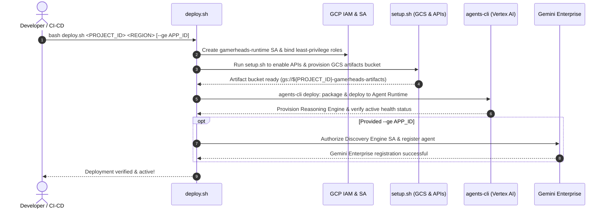
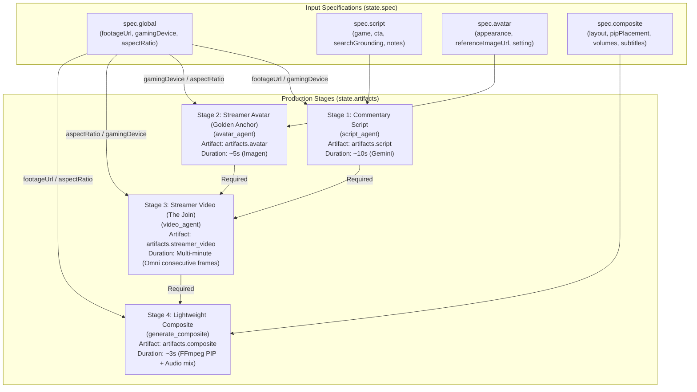

# GamerHeads Gameplay Reaction Director

An AIGC creative director agent built with **Google ADK (Agent Development Kit)** and **`agents-cli`**. It automatically transforms raw gameplay footage into polished streamer reaction videos complete with **custom streamer likenesses, commentary scripts, lip-synced reaction synthesis, and picture-in-picture (PIP) / split-screen post-production**.

---

## Table of Contents

- [🚀 One-Click Deployment Guide (`deploy.sh`)](#-one-click-deployment-guide-deploysh)
  - [Quick Deploy](#quick-deploy)
  - [Prerequisites](#prerequisites)
  - [Syntax & Parameters](#syntax--parameters)
  - [Automated Workflow](#automated-workflow)
  - [Deployment Scenarios](#deployment-scenarios)
  - [Cloud Resource Teardown (`setup.sh`)](#cloud-resource-teardown-setupsh)
- [🌟 Core Features](#-core-features)
- [📐 System Architecture & Workflow (Diamond DAG)](#-system-architecture--workflow-diamond-dag)
- [💻 Local Development & Quick Start](#-local-development--quick-start)
- [📁 Project Directory Structure](#-project-directory-structure)
- [📋 CLI Reference Cheat Sheet](#-cli-reference-cheat-sheet)
- [📡 Observability & A2A Protocol Support](#-observability--a2a-protocol-support)

---

## 🚀 One-Click Deployment Guide (`deploy.sh`)

The repository provides a production-ready one-click deployment script, [`deploy.sh`](file:///Users/zgz/gamerheads-agent/deploy.sh), which fully automates deploying the GamerHeads Director to **Google Cloud Vertex AI Agent Runtime (Reasoning Engine)**, with optional seamless registration to **Gemini Enterprise**.

### Quick Deploy

A single command handles service account provisioning, IAM role binding, cloud resource setup, dependency packaging, Vertex AI deployment, and live health verification:

```bash
# Deploy to Vertex AI Agent Runtime (default region: us-central1)
bash deploy.sh <YOUR_PROJECT_ID>

# Deploy and register directly to Gemini Enterprise
bash deploy.sh <YOUR_PROJECT_ID> us-central1 --ge <YOUR_GE_APP_ID>
```

---

### Prerequisites

Before deploying, ensure you have set up the following:

1. **Google Cloud SDK (`gcloud`)**: Installed and authenticated - [Installation Guide](https://cloud.google.com/sdk/docs/install)
   ```bash
   gcloud auth login
   gcloud auth application-default login
   ```
2. **GCP Project Permissions**: Your deployer identity requires `Owner` or `Editor` + `Security Admin` on the target project (to create Service Accounts and bind IAM policies).
3. **Python & uv**: Python `>= 3.11, < 3.14` with the `uv` package manager installed - [Installation Guide](https://docs.astral.sh/uv/getting-started/installation/)

---

### Syntax & Parameters

```bash
bash deploy.sh <PROJECT_ID> [REGION] [--ge APP_ID]
```

Or using explicit flags:

```bash
bash deploy.sh <PROJECT_ID> --region <REGION> --ge <APP_ID>
```

#### Parameter Reference

| Parameter / Flag | Required | Default | Description |
| :--- | :---: | :---: | :--- |
| `PROJECT_ID` | **Yes** | - | Target Google Cloud Project ID (first positional argument). |
| `REGION` / `-r` / `--region` | No | `us-central1` | Deployment region (e.g. `us-central1`, `us-east4`). |
| `--ge APP_ID` / `--ge=APP_ID` | No | - | Gemini Enterprise Application (Search/Assistant Engine) ID. When provided, automatically binds permissions and registers the agent to the specified assistant. |

---

### Automated Workflow

[`deploy.sh`](file:///Users/zgz/gamerheads-agent/deploy.sh) executes four end-to-end stages in sequence:



#### 1. Dedicated Runtime Service Account & IAM Setup
- Provisions a dedicated service account: `gamerheads-runtime@${PROJECT_ID}.iam.gserviceaccount.com`.
- Grants least-privilege roles for Vertex AI, logging, tracing, and service usage:
  - `roles/aiplatform.user`
  - `roles/serviceusage.serviceUsageConsumer`
  - `roles/logging.logWriter`
  - `roles/cloudtrace.agent`
- Configures Token Creator (`roles/iam.serviceAccountTokenCreator`) and assigns the deploying user `roles/iam.serviceAccountUser`.

#### 2. Cloud Resource Initialization ([`setup.sh`](file:///Users/zgz/gamerheads-agent/setup.sh))
- Enables required Google Cloud APIs (Vertex AI, Cloud Build, Cloud Storage, Discovery Engine, Cloud Trace, App Hub, etc.).
- Creates the dedicated artifacts bucket: `gs://${PROJECT_ID}-gamerheads-artifacts` (with uniform bucket-level access).
- Grants bucket-scoped `roles/storage.objectAdmin` to the runtime service account.

#### 3. Packaging & Vertex AI Reasoning Engine Deployment
- Syncs project dependencies and ensures `agents-cli` is ready.
- Runs `agents-cli deploy` to package and deploy to Vertex AI Reasoning Engine.
- Injects runtime environment variables:
  - `ARTIFACT_BUCKET_NAME=${PROJECT_ID}-gamerheads-artifacts`
  - `GOOGLE_CLOUD_LOCATION=global`
- Performs live health checks via the Vertex AI REST API to confirm the engine state is `ACTIVE`.

#### 4. Seamless Gemini Enterprise Registration (Optional)
- Triggered automatically when `--ge <APP_ID>` is supplied.
- Resolves the GCP Project Number and grants the Discovery Engine Service Account (`service-${PROJECT_NUM}@gcp-sa-discoveryengine.iam.gserviceaccount.com`) invocation access (`roles/aiplatform.user`).
- Reads localized display names and descriptions from [`agent.yaml`](file:///Users/zgz/gamerheads-agent/agent.yaml).
- Calls the Discovery Engine v1alpha REST API to mount the Reasoning Engine instance as a custom agent under the specified assistant collection.

---

### Deployment Scenarios

#### Scenario 1: Deploy to Vertex AI Agent Runtime

Deploy with default settings (`us-central1`):
```bash
bash deploy.sh my-gcp-project-id
```

Specify a custom deployment region:
```bash
bash deploy.sh my-gcp-project-id us-central1
# Or using the flag
bash deploy.sh my-gcp-project-id --region=us-central1
```

#### Scenario 2: Deploy & Register to Gemini Enterprise

Deploy the agent and register it to your Gemini Enterprise assistant (e.g., `gamerheads-assistant`):
```bash
bash deploy.sh my-gcp-project-id us-central1 --ge gamerheads-assistant
```

---

### Cloud Resource Teardown (`setup.sh`)

To clean up cloud resources created during testing, use the `--cleanup` flag in [`setup.sh`](file:///Users/zgz/gamerheads-agent/setup.sh):

```bash
# Delete the provisioned GCS artifacts bucket
bash setup.sh my-gcp-project-id us-central1 --cleanup
```

> [!WARNING]
> The `--cleanup` flag permanently deletes the `gs://${PROJECT_ID}-gamerheads-artifacts` bucket and all generated video/image deliverables inside it.

---

## 🌟 Core Features

- 🎬 **Intelligent Gameplay Comprehension & Scripting (Commentary Script)**: Analyzes video pacing and gameplay highlights, paired with Google Search Grounding to pull game lore and current memes into a timed, shot-by-shot commentary script.
- 🎨 **Streamer Likeness Design (Golden Anchor Avatar)**: Configures streamer appearance, apparel, studio setting, and handheld gaming peripherals (e.g. controller or handheld console), generating a high-fidelity master portrait via Imagen.
- 🗣️ **Continuous Motion, Expressions & Lip-Sync (Streamer Reaction Video)**: Starting from the Golden Anchor portrait, conditions image-to-video generation across consecutive frames to synthesize smooth, expressive, lip-synced reaction clips.
- 🎞️ **Picture-in-Picture & Multi-Track Audio Post-Production (Lightweight Composite)**: Produces picture-in-picture (PIP) or split-screen layouts in ~3 seconds via FFmpeg, balancing game audio with commentary and burning in styled subtitles.
- 📊 **Dynamic DAG Dependency Management & Live Kanban (Pipeline Kanban)**: Strictly partitions inputs (`spec`) from deliverables (`artifacts`), featuring automatic downstream impact detection (`detect_impact`) and a zero-context-decay Kanban dashboard.

---

## 📐 System Architecture & Workflow (Diamond DAG)

The pipeline is modeled as a **Diamond DAG (Directed Acyclic Graph)** with strict separation between inputs and outputs:



### Architectural Principles
1. **Decoupled Pre-Production (Stages 1 & 2)**: Commentary scripting and streamer portrait generation are completely independent. Creators can initiate either branch first or develop both simultaneously.
2. **The Join Node (Stage 3 - Streamer Video)**: The only node requiring both `artifacts["script"]` and `artifacts["avatar"]`. Generates sequential clips conditioned on the Golden Anchor and preceding segment end-frames.
3. **Sub-Second Post-Production (Stage 4 - Composite)**: Modifying layout (PIP corner), volume balance, or subtitles takes ~3 seconds of FFmpeg re-rendering without re-running expensive streamer video generation.
4. **Strict Two-Root State Model**: Session state cleanly isolates inputs (`state["spec"]`) from generated deliverables (`state["artifacts"]`).

---

## 💻 Local Development & Quick Start

### 1. Sync Dependencies

```bash
uv sync
# Or via agents-cli
agents-cli install
```

### 2. Launch Local Interactive Playground

Use `agents-cli playground` for real-time local debugging with hot-reloading:

```bash
agents-cli playground
```

### 3. Run Automated Tests

```bash
uv run pytest tests/unit tests/integration
```

### 4. Run Quality Evaluations

```bash
# Run evaluations over the default dataset and grade traces
agents-cli eval run

# List built-in evaluation metrics
agents-cli eval metric list
```

---

## 📁 Project Directory Structure

```
gamerheads-agent/
├── app/                                # Core Agent business logic
│   ├── agent.py                        # Director Agent (Coordinator)
│   ├── agent_runtime_app.py            # Vertex AI Agent Runtime entry point
│   ├── fast_api_app.py                 # FastAPI backend server
│   ├── pipeline.py                     # Pipeline state manager, DAG analyzer & Kanban
│   ├── agents/                         # Specialist Domain Subagents
│   │   ├── avatar_agent.py             # Streamer avatar generation agent
│   │   ├── script_agent.py             # Gameplay commentary scriptwriting agent
│   │   └── video_agent.py              # Reaction video & composite scheduling agent
│   ├── media/                          # Media generation & FFmpeg utilities
│   │   ├── clips.py                    # Video segmentation & timestamp alignment
│   │   ├── composite.py                # FFmpeg PIP layout & audio mixing
│   │   ├── omni.py                     # Omni image/video generation client
│   │   ├── stitch.py                   # Seamless multi-segment stitching
│   │   └── subtitles.py                # Subtitle generation & styling
│   ├── tools/                          # ADK tool definitions
│   │   ├── ingest_tools.py             # Media & Google Drive asset downloader
│   │   └── spec_tools.py               # Spec schema updates & change tracking
│   ├── plugins/                        # ADK plugins (deliverable filter, artifact saving)
│   └── app_utils/                      # A2A protocol & runtime adapters
├── tests/                              # Test suites
│   ├── unit/                           # Unit tests (Pipeline, Media, Agents, Plugins)
│   ├── integration/                    # End-to-end integration tests
│   └── eval/                           # Eval datasets & LLM-as-judge configs
├── deployment/                         # Deployment templates & Terraform infrastructure
├── deploy.sh                           # 🚀 Automated deployment script (Vertex AI + GE)
├── setup.sh                            # 🛠️ Cloud resource provisioning & teardown script
├── agent.yaml                          # Agent metadata & localized descriptions
├── Dockerfile                          # Containerization configuration
└── pyproject.toml                      # Project dependencies & build config (uv)
```

---

## 📋 CLI Reference Cheat Sheet

| Task | Command | Description |
| :--- | :--- | :--- |
| **Install Dependencies** | `uv sync` or `agents-cli install` | Install runtime and development packages |
| **Local Playground** | `agents-cli playground` | Launch local interactive web development interface |
| **Lint & Format** | `agents-cli lint` | Run Ruff, type checks, and code quality scans |
| **Run Tests** | `uv run pytest tests/unit tests/integration` | Run unit and integration test suites |
| **Evaluation** | `agents-cli eval run` | Evaluate agent behavior with LLM-as-judge |
| **One-Click Deploy** | `bash deploy.sh <PROJECT_ID>` | Deploy to Vertex AI Agent Runtime |
| **Publish to GE** | `agents-cli publish gemini-enterprise` | Register deployed agent with Gemini Enterprise |
| **Infra & CI/CD** | `agents-cli scaffold enhance` | Add CI/CD pipelines and Terraform infrastructure |

---

## 📡 Observability & A2A Protocol Support

### Cloud Observability
The agent integrates natively with Google Cloud telemetry via ADK:
- **Cloud Trace**: Distributed tracing for incoming user requests, tool latency, and LLM calls.
- **Cloud Logging**: Structured event logs and real-time pipeline status transitions.
- **BigQuery Agent Analytics**: Long-term session metrics and operational analytics.

### A2A Protocol Interoperability
This agent fully implements the [A2A Protocol](https://a2a-protocol.org/):
- Can be discovered and invoked as a specialist subagent by other multi-agent systems.
- Compatible with the [A2A Inspector](https://github.com/a2aproject/a2a-inspector) for live protocol and interoperability testing.
